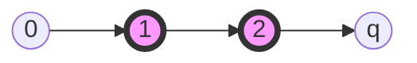
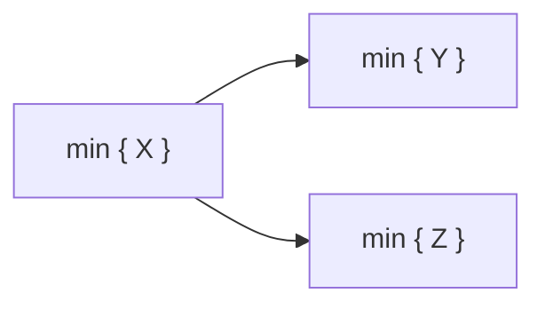

# Floyd-Warshall

Floyd-Warshall's **Dynamic Programming** Bottom-Up algorithm solves the **Multiple-Source, Multiple-Destination** shortest-paths problem on a edge-weighted, directed graph $G = (V, E, w : E \rightarrow \mathbb{R})$ in the general case where there could be negative weights, but **no negative-weight cycles** are present. The algorithm does not fail when **negative cycles are present** but is **not reliable**!

| Type                          | Input                                 | Output                      | $T(n)$          | $S(n)$        |
| ----------------------------- | ------------------------------------- | --------------------------- | ----------------- | --------------- |
| Dynamic-Programming Bottom-Up | $W$, matrix representation of $G$ | $D$,  matrix of distances | $\Theta(n^{3})$ | $\Theta(n^3)$ |

---

## 1 - Preamble

With the _tools_ we have used until now, can we find a solution for this problem? We could be design Dijkstra or a BF algorithm for all-pairs like so:

```python
Iterated_Dijkstra(G, w)
    for each u in V[G]:
        Dijkstra(G, w, u) 
```

Complexity

| Density \ Algorithm | Iterated_Dijkstra_arr | It_Dijkstra_heap   | It_BF        |
| ------------------- | --------------------- | ------------------ | ------------ |
| Dense               | $O(n^{2})$          | $O(n^{3}log(n))$ | $O(n^{4})$ |
| Sparse              | $O(n^{3})$          | $O(n^{2}log(n))$ | $O(n^{3})$ |

But can we improve this?

---

## 2 - Definitions to keep in mind

### 2.1 - $\mathfrak{D}_{ij}$, Set of simple paths from $i$ to $j$

Let $G=(V,E)$ a graph and let $i,j \, \in \, V$, be any two vertices in $V$. We define the **set of simple paths from i to j** as:

```math
\mathfrak{D}_{ij} = \left\{ p \mid p = \, < \, x_{0} = i \,,  \ldots \,, x_{q} = j \, > \, \wedge \, p \, \text{ is  a \bf{simple} path }\right\}
```


It can be empty, by definition of "reachable node", when $j$ is not reachable from $i$.

### 2.2 - Intermediate vertex

Let $p = \, < \, x_{0} \,,  \ldots \,, x_{q} \, >$ be a simple path from $x_{0}$ to $x_{q}$. A vertex $x_{i}$ is called **intermediate vertex** if:

```math
x_{i} \in p \, \wedge \, x_{i} \neq x_{0} \, \wedge \, x_{i} \neq x_{q}
```

Example of intermediate vertices where $1$ and $2$ are intermediate vertices:



### 2.3 - $\mathfrak{D}^{k}_{ij}$, Set of k-limited simple paths from $i$ to $j$

Let $G=(V,E)$ a graph where all nodes are distinctly labeled with a number such that $V = \{ 1 \,, \ldots \,, n \}$. Let $i,j \, \in \, V$, be any two vertices in $V$ and let $k \in V = \{ 1 \,, \ldots \,, n \}$ be a label.

We define the **set of k-limited simple paths from i to j** as:

```math
\mathfrak{D}^{k}_{ij} = \left\{ p \mid p \in \mathfrak{D}_{ij} \text{ is a \bf{simple} path from i to j where all the intermediate vertices have a label that is } \leq k \right\}
```

Or as:

```math
\mathfrak{D}^{k}_{ij} = \left\{ p \mid p = \, < \, x_{0} = i \,,  \ldots \,, x_{q} = j \, > \, \in \mathfrak{D}_{ij} : \, x_{l} \leq k \,, \forall \, l = 1 \,, \ldots \,, q-1 \right\}
```

Example of a path from $i$ to $j$ with $k=3$:


It can be empty, by definition of "reachable node", when $j$ is not reachable from $i$.

### 2.4 - Bottom-Up decomposition of a problem ([Dynamic Programming](https://github.com/PayThePizzo/Data-Structures-and-Algorithms/blob/main/Theory/7%20-%20Dynamic%20Programming/0%20-%20DYNAMIC%20PROGRAMMING.md#bottom-up-method-with-tabulation)) applied to sets

Given a set $X$ we want to find its minimum element, $\min \left\{ X \right\}$. Since it is a set, we know we can decompose it into two partitions $Y$ and $Z$ such as $Y \cap Z = \emptyset \, \wedge \, Y \cup Z = X$.
Finding the minimum of a set equals finding the minimum out of all its partitions. Therefore, our original problem can be decomposed as

```math
\min \left\{ X \right\} = \min \left\{ \min \left\{ Y \right\}, \min \left\{ Z \right\} \right\}
```



---

## 3 - Assumptions and Premises

We assume that:

1. Let $G=(V,E)$ a directed and edge-weighted graph with $w: E \rightarrow \mathbb{R}$ weight function such that negative weights are possible but no negative cycle is allowed.
   1. Even though the algorithm can be used to locate negative cycles, We just need to look at the **main diagonal**. **If it contains numbers lower than 0**, then there are negative cycles and the result is not reliable.
2. Let vertices in $V$ be distinctly labeled with natural numbers from $1$ to $n$  ($V = \{ 1, \ldots \,, n \}$).
3. Let $W = (w_{ij}) \in \mathbb{R}^{n \times n}$ be the matrix representation of the graph G such that:

```math
 w_{ij} = \quad \left\{\begin{matrix}
 0 & i=j \\
 w(i \, j) \in \mathbb{R}  & i \neq  j \, \wedge (i \, j) \in E \\
 +\infty & i \neq  j \, \wedge (i \, j) \notin E \\
\end{matrix}\right. 
```

---

## 4 - Data Structures

Since the algorithm performs operation in a matrix-like data structure, represent the
entry graph as a matrix. The algorithm, takes a matrix $W$ for input and returns a matrix $D$
in output, which is the matrix of distances. Another version of the algorithm returns the function of predecessors.

**INPUT**: The matrix representing the graph, $W = D^{(k=0)}$, with $w_{ij} \in R^{n \, \times \, n}$ such that:

```math
w_{ij} = \quad \left\{\begin{matrix}
0 & i=j \\
w(i \, j)  & i \neq  j \, \wedge (i \, j) \in E \\
+\infty & i \neq  j \, \wedge (i \, j) \notin E \\
\end{matrix}\right. 
```

**OUTPUT**: The matrix, $D = D^{k=n}$ with $d_{ij} \in R^{n \, \times \, n}$ in which we expect $d_{ij} = \delta(i \,, j)$

```math
\mathfrak{D}_{ij} = \left\{ p = <x_{0} \,, \ldots \,, x_{q}> \, \mid \, p \, \text{is a \bf{simple} path } \, \wedge \, x_{0}=i \, \wedge \, x_{q}=j \right\}$
```

It is *the set of simple paths from i to j* (it can be empty). We assume this because set of simple SPs is finite

$\Pi$ The predecessors' matrix with $\pi_{ij}$:

* **NIL** if i=j or w(ij)=+inf()
* **i** if i!=j and w(ij)< inf()

It can  be  modified to return the paths too (not only the distances).

The algorithm FW starts from $D^{(0)} = W$, and produces a sequence of matrices: $D^{1} \,, \ldots \,,  D^{n}$

* When $D^{n}$, namely D, the final matrix represents the real-distances matrix.

How do we compute these matrices? Given the matrix $D^{(k-1)}$, how do we compute $D^{(k)}$ ?

* This equals to computing $d^{k}_{ij}$ , given $d^{k-1}_{ij}$

---

## 5 - The Algorithm

```python
FLOYD_WARSHALL(W)
    n <- rows(W);
    D^0 <- W;
    for k = 1 to n: #Computes the sequence of D^k
        for i = 1 to n:
            for j = 1 to n :
                d^{k}_{ij} = min{d^{k-1}_{ik} + d^{k-1}_{kj}, d^{k-1}_{ij}};
    return D^n;
```

**Final Time Complexity**: $T(n) = \Theta(n^3)$

### 5.1 - Time Complexity Demonstration

1) First operations are constant: $O(1)$
2) 3 nested for: $T(n) = \Theta(n^3)$
   1) $\min\{ \}$ can be found in constant time: $O(1)$

### 5.2 - Spatial Complexity Demonstration

From a spatial point of view, the algorithm generates $n$ matrices of size $n^2$.
So in total, $S(n) = \Theta(n^3)$.

Is it necessary to keep track of all of them? We do not need them, at $k$-th step we just need
the previous one, maybe we just need two. However, we can do even more!
We can use just one matrix and overwrite its content of without conflicts/dirty-write.

We'll see this in the properties section!

---

## 6 - Correctness Demonstration

Let $G=(V,E)$ a directed and edge-weighted graph with $w: E \rightarrow \mathbb{R}$ weight function such that negative weights are possible but no negative cycle is allowed.
Let vertices in $V$ be distinctly labeled with natural numbers from $1$ to $n$  ($V = \{ 1, \ldots \,, n \}$).
Let $W = (w_{ij}) \in \mathbb{R}^{n \times n}$ be the matrix representation of the graph G such that:

```math
 w_{ij} = \quad \left\{\begin{matrix}
 0 & i=j \\
 w(i \, j) \in \mathbb{R}  & i \neq  j \, \wedge (i \, j) \in E \\
 +\infty & i \neq  j \, \wedge (i \, j) \notin E \\
\end{matrix}\right. 
```

Let $D = (d_{ij}) \in \mathbb{R}^{n \times n}$ be the matrix of distances produced

We want to demonstrate that at the end of the algorithm, at step $k=n$, $D^{k} = D$ is the matrix of real distances.

**(1)** We expect that at the end of the algorithm the elements of the output matrix of the distances represent the real distance between two vertices:

```math
d_{ij} = \delta (i,j) \,, \forall i,j \in V
```

**(2)** Let's introduce the set of simple paths from $i$ to $j$, $\mathfrak{D}_{ij}$:

> Let $G=(V,E)$ a graph and let $i,j \, \in \, V$, be any two vertices in $V$. We define the **set of simple paths from i to j** as:
>
> $\mathfrak{D}_{ij} = \left\{ p \mid p = \, < \, x_{0} = i \,,  \ldots \,, x_{q} = j \, > \, \wedge \, p \, \text{ is  a \bf{simple} path }\right\}$
>
> It can be empty, by definition of "reachable node", when $j$ is not reachable from $i$.

**(3)** We can certainly agree that finding the shortest path for any $i,j \in V$ is the same as finding the path with the minimum weight between all the simple paths between $i$ and $j$:

```math
\delta (i,j) = \min_{p \in \mathfrak{D}_{ij}} \left\{ w(p) \right\}
```

This is true because, by **assumption of absence of negative cycles**, we can surely say that between all the possible shortest paths, there is always at least one shortest path that is also simple.

* We are looking for shortest paths in $\mathfrak{D}_{ij}$ which ensures we are picking only simple paths.
* It is possible to find a shortest path $p$ that is not simple but, under these hypothesis, we can always find a shortest path that is also simple.
  * As we saw before, if a shortest path $p$ had a cycle $c$ where a node $v$ repeats itself twice, this cycle must have a weight equal to $0$ and $c$ can be replaced with a subpath from $v$ to itself (which always exists in absence of negative cycles) to obtain a simple shortest path with the same weight.
    * It cannot surely be a negative cycle $w(c) \nless 0$, by assumption (again).
    * It cannot surely be a positive cycle $w(c) \ngtr 0$, because this would invalidate the property that **sub-paths of shortest paths are also shortest-paths**. In fact, there always exists a path from $v$ to itself of length $0$ and we could substitute the cycle $c$ with this other subpath, making it lighter and invalidating the assumption of $p$ being shortest path.
    * It must happen that $w(c) = 0$, hence the initial non-simple shortest path containing a cycle can be modified to obtain a simple shortest path by replacing the cycle with a simple path from $v$ to itself (without invalidating the property of the previous point).

**(4)** Let's introduce the notion of intermediate vertex and the set of k-limited simple paths $\mathfrak{D}^{(k)}_{ij}$:

> Let $p = \, < \, x_{0} \,,  \ldots \,, x_{q} \, >$ be a simple path from $x_{0}$ to $x_{q}$. A vertex $x_{i}$ is called **intermediate vertex** if $x_{i} \in p \, \wedge \, x_{i} \neq x_{0} \, \wedge \, x_{i} \neq x_{q}$

> Let $G=(V,E)$ a graph where all nodes are distinctly labeled with a number such that $V = \{ 1 \,, \ldots \,, n \}$. Let $i,j \, \in \, V$, be any two vertices in $V$ and let $k \in V =  \{ 1 \,, \ldots \,, n \}$ be a label.
>
> $\mathfrak{D}^{k}_{ij} = \left\{ p \mid p \in \mathfrak{D}_{ij} \text{ is a \bf{simple} path from i to j where all the intermediate vertices have a label that is } \leq k \right\}$
>
> It can be empty, by definition of "reachable node", when $j$ is not reachable from $i$.

**(5)** Generally we can say that:

```math
\mathfrak{D}^{(k)}_{ij} \subseteq \mathfrak{D}^{(k+1)}_{ij} \,, \forall  k = 1\,, \ldots \,,  n-1
```

Why is that?

**(5.1)** First of all, when $k=0$ it means $\mathfrak{D}^{(k=0)}_{ij}$ is the set of simple paths $p$ from $i$ to $j$ where all the intermediate vertices have label $\leq 0$. From this it is easy to see that:

* These simple paths have no intermediate vertices at all, because the labels start from the number $1$ and requiring the label to be $0$ means no vertex can be an intermediate vertex.
* Any simple path with no intermediate vertices means the path is simply made up of **two nodes**, say $i$ and $j$, and **at most one edge**, say $(i, j) \in E$.
* Then, $\mathfrak{D}^{(0)}_{ij}$ is the set of simple paths from $i$ to $j$ such that they contain at most 1 edge connecting the two vertices directly if $(i,j) \in E$ (else it's empty).

So we can also say that at this time $W = D^{0}$ where the elements of the matrix of distances at $k=0$ coincide with the real distance as we just defined it: $d^{(0)}_{ij} = \delta (i,j) = \min_{p \in \mathfrak{D}^{0}_{ij}} \left\{ w(p) \right\}$.

This is true because we are looking for the paths with minimum weight out of all the simple paths with at most one edge from $i$ to $j$ and by definition of distance we have that:

```math
d^{0}_{ij} = \quad \left\{\begin{matrix}
0 & i=j \\
w(i \, j)  & i \neq  j \, \wedge (i \, j) \in E \\
+\infty & i \neq  j \, \wedge (i \, j) \notin E \\
\end{matrix}\right. 
```

**(6)** Finally, when $k=n$ it means $\mathfrak{D}^{(k=n)}_{ij}$ is the set of simple paths $p$ from $i$ to $j$ where all the intermediate vertices have label $\leq n$. From this it is easy to see that:

```math
\mathfrak{D}^{(k=n)}_{ij} = \mathfrak{D}^{(n)}_{ij} = \mathfrak{D}_{ij}
```

This is true by definition of $\mathfrak{D}_{ij}$ since it includes all possible simple paths between $i$ and $j$, the set trivially includes the set of all possible simple paths between $i$ and $j$ ($\mathfrak{D}^{(k=n)}_{ij}$) where all the intermediate vertices are $\leq n$ (as $n$ is the largest label). Plus it surely includes all of the simple paths included in $\mathfrak{D}^{(k)}_{ij}$ with $0 \leq k \leq n-1$

**(7)** Let's introduce the weight of the shortest path from $i$ to $j$, between all the simple shortest paths whose intermediate vertices are $\leq k$, $d^{(k)}_{ij}$:

```math
d^{(k)}_{ij} = \min_{p \in \mathfrak{D}^{(k)}_{ij}} \left\{ w(p) \right\}
```

**(8)** When $k=n$ we have $\mathfrak{D}^{(k=n)}_{ij} = \mathfrak{D}^{(n)}_{ij} = \mathfrak{D}_{ij}$, and computing the real distance between $i$ and $j$ is the same as computing the element $d^{(k=n)}_{ij} = d^{(n)}_{ij}$ of the matrix:

```math
\delta (i,j) = d^{(n)}_{ij}
```

This is true by definitions we gave in the previous points.

**(9)** We know that FW produces a sequence of matrices $D^{(k)} \,, \forall k = 0 \,,  \ldots \,, n$ are sure that:

When $k=0$, we have that $D^{(0)} = W$

When $k=n$, we have that

**(10)** What we need to show now is, given a matrix $D^{(k-1)}$, how do we generate the matrix $D^{(k)}$ ?

This is the same as asking how to compute $d^{(k)}_{ij}$ from $d^{(k-1)}_{ij}$.

**(11)** Let us introduce a simple principle from dynamic programming that we can apply to sets:

> Given a set $X$ we want to find its minimum element, $\min \{ X \}$. Since it is a set, we know we can decompose it into two partitions $Y$ and $Z$ such as $Y \cap Z = \emptyset \, \wedge \, Y \cup Z = X$.
> Finding the minimum of a set equals finding the minimum out of all its partitions. Therefore, our original problem can be decomposed as $\min \{ X \} = \min \{ \min\{ Y \}  \,, \min\{ Z \} \}$.

Since the problem is to find:

```math
d^{(k)}_{ij} = \min_{p \in \mathfrak{D}^{(k)}_{ij}} \left\{ w(p) \right\}
```

We can define two partitions of the set $\mathfrak{D}^{(k)}_{ij}$:

1. The set of simple paths from $i$ to $j$ which include the vertex $k$, $\mathfrak{\hat{D}}^{(k)}_{ij} = \left\{ p \mid p \in \mathfrak{D}^{(k)}_{ij} \text{ that go through } k \right\}$
2. The set of simple paths from $i$ to $j$ which do not include the vertex $k$, $\mathfrak{D}^{(k-1)}_{ij}$
   1. Trivially, there won't be vertices with label larger or equal to $k$.

```math
\mathfrak{D}^{(k)}_{ij} = \mathfrak{\hat{D}}^{(k)}_{ij} \, \cup \,\mathfrak{D}^{(k-1)}_{ij}
```

Then our problem becomes, by the principle we just saw:

```math
d^{(k)}_{ij} = \min_{p \in \mathfrak{D}^{(k)}_{ij}} \left\{ w(p) \right\} = \min \left\{ \min_{p \in \mathfrak{\hat{D}}^{(k)}_{ij}} \left\{ w(p) \right\} \,, \min_{p \in \mathfrak{D}^{(k-1)}_{ij}} \left\{ w(p) \right\} \right\}
```

From before we know that $d^{(k-1)}_{ij} = \min_{p \in \mathfrak{D}^{(k-1)}_{ij}} \left\{ w(p) \right\}$

Now we want to understand how to define better, the remaining puzzle piece. From the definition of $\mathfrak{\hat{D}}^{(k)}_{ij}$, we gather that the paths in this set are simple paths that go from $i$ to $j$, with labels that are $\leq k$, and go through $k$ at some point. These paths, can all be split into two sub-paths creating two new subsets:

1. The simple paths that go from $i$ to $k$, with labels that are $\leq k$. These paths, by definition, belong to $\mathfrak{D}^{(k)}_{ik}$
2. The simple paths that go from $k$ to $j$, with labels that are $\leq k$. These paths, by definition, belong to $\mathfrak{D}^{(k)}_{kj}$

```math
\mathfrak{\hat{D}}^{(k)}_{ij} = \mathfrak{D}^{(k)}_{ik} \, \cup \,  \mathfrak{D}^{(k)}_{kj}
```

However, these definitions do not play well for the recursive structure we want to give to the problem. In fact, thanks to the fact that we are considering **simple paths** we can say even more:

1. The simple paths that go from $i$ to $k$, with labels that are $\leq k$, also belong to the set of paths that go from $i$ to $k$, with labels that are $\leq k-1$ because by definition, no intermediate vertex can have label equal to $k$ **otherwise it would invalidate the assumption of simple paths**. This set can be called $\mathfrak{D}^{(k-1)}_{ik}$
2. The simple paths that go from $k$ to $j$, with labels that are $\leq k$, also belong to the set of paths that go from $k$ to $j$, with labels that are $\leq k-1$ because by definition, no intermediate vertex can have label equal to $k$ **otherwise it would invalidate the assumption of simple paths**. This set can be called $\mathfrak{D}^{(k-1)}_{kj}$

```math
\mathfrak{\hat{D}}^{(k)}_{ij} = \mathfrak{D}^{(k-1)}_{ik} \, \cup \,  \mathfrak{D}^{(k-1)}_{kj}
```

Now we can recursively decompose the problem of finding the shortest-paths in sets of simple paths, thanks to **the property that sub-paths of shortest paths are shortest-paths too** and **property of decomposition of distances**:

```math
d^{(k)}_{ij} = \min \left\{ \min_{p \in \mathfrak{D}^{(k-1)}_{ik}} \left\{ w(p) \right\}  \,+ \, \min_{p \in \mathfrak{D}^{(k-1)}_{kj}} \left\{ w(p) \right\} \,, \min_{p \in \mathfrak{D}^{(k-1)}_{ij}} \left\{ w(p) \right\} \right\}
```

As we know from previous definitions, we can finally write:

```math
d^{(k)}_{ij} = \min \left\{ d^{(k-1)}_{ik} \, + \, d^{(k-1)}_{kj} \,, d^{(k-1)}_{ij} \right\}
```

From which we derive the formula that FW uses:

```math
d^{k}_{ij} = \quad \left\{\begin{matrix}
w(i,j) & k=0 \\ \\
\min \left\{ d^{(k-1)}_{ik} \, + \, d^{(k-1)}_{kj} \,, d^{(k-1)}_{ij} \right\} & else
\end{matrix}\right. 
```

---

## 7 - Properties

### 7.1 - Property 1

**If there are no negative cycles (as for hypothesis), the main diagonal is always filled with zeros**

For k=1 to n, d^k(ii) = 0:

* d^k(ii) = 0
* d^k(ii) = d^k(ii) = min{d^k-1(ik)+ d^k-1(ki), d^k-1(ii)}
* d^k(ii) = d^k(ii) = min{d^k-1(ik)+ d^k-1(ki), 0}, by hypothesis
  * d^k-1(ik)+ d^k-1(ki) means there is a cycle that goes from i to k and back to i.
  * A cycle, since there are no negative cycles, must be >= 0.
  * In this case, the minimum we can find is 0!

### 7.2 - Property 2

**During the transition from D^k-1 to D^k, the row k and column k do not change**.
The elements of the column **k-1** and row **k-1** we have considered, at a time **k-1**,
do not change at a time k!

* Ex: D^0 -> D^1, column 0 and row 0, do not change when we are in D^1!

For i,j,k∈V

* d^k(ik) = d^k-1(ik)
* d^k(kj) = d^k-1(kj)

Why is this true? (We'll show only one but it works for both)

* d^k(ik) = d^k-1(ik) **?**
  * d^k(ik) = min{d^k-1(ik), d^k-1(ik) + d^k-1(kk)}
  * d^k(ik) = min{d^k-1(ik), d^k-1(ik) + 0}, by property 1
  * d^k(ik) = min{d^k-1(ik), d^k-1(ik)}
  * d^k(ik) = d^k-1(ik)

To determine the value of d^k(ij), at time k-1, we look for the **minimum** between

1. d^k-1(ik)+ d^k-1(kj) the sum of the elements **kj+ik** at time k-1 of the matrix D^k-1 and,
2. d^k-1(ij), the element in **ij** at time k-1 of the matrix D^k-1

### 7.3 - Property 3

If we need to compute a result, and we find +inf() on the column or row we are considering,
we can copy that particular row or column. The minimum between +inf() and a small number, is always that number!

* Look out for negative cycles!


Thanks to the property 2, we can reformulate the algorithm now:

```python
FLOYD_WARSHALL(W)
    n = rows[W]; # count of rows
    D^0 = W;
    for(k=1 to n): #Computes the sequence of D^k
        for(i=1 to n):
            for(j=1 to n):
                d^k(ij) = min{d^(k-1)(ik)+ d^(k-1)(kj), d^(k-1)(ij)};
    return D;
```

---

#### Example


It is better using FW than Dijkstra!
